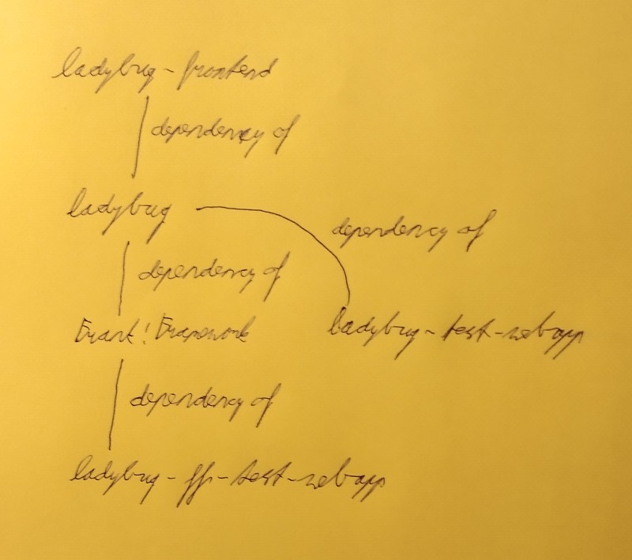
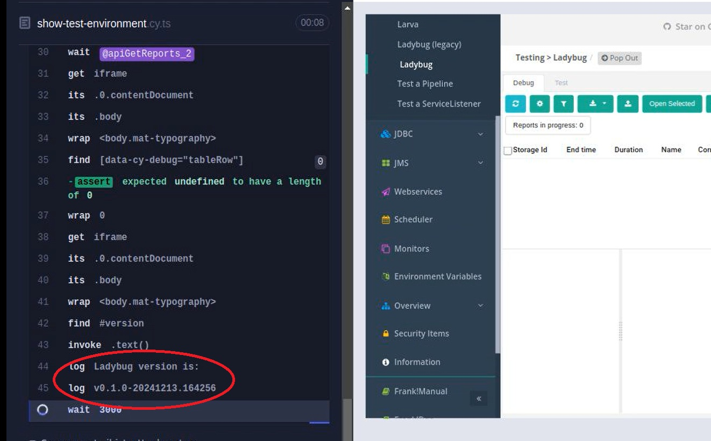

# How to contribute to Ladybug

This document helps you to contribute to Ladybug. It focuses on how to start and test Ladybug. Ladybug is related to many different GitHub projects. There are multiple ways to start Ladybug that each have their own benefits for testing. The CI/CD around Ladybug is also explained. The logic of the tests is complicated, so this document ends with guidelines to protect the quality of the test code.

# Overview of Ladybug and GitHub projects

Ladybug is a debugger that is intended for Java applications. A Java application debugged by Ladybug is expected to process incoming messages. These messages undergo a series of transformations. The Java application is expected to report about these to Ladybug, resulting in *checkpoints*. Each message received by the Java application results in a Ladybug *report*. Ladybug allows its users to *rerun* reports. This allows reports to be used as test cases.

Ladybug is treated as a stand-alone product that can be used by any Java application. An important target application however is the Frank!Framework, https://github.com/frankframework/frankframework; the Frank!Framework is shipped with Ladybug included (as Maven dependency). To test Ladybug as an independent project, we include it in the a small test application ladybug-test-webapp, https://github.com/wearefrank/ladybug-test-webapp. It provides links to generate Ladybug reports and provides access to the Ladybug user interface. The first choice on starting Ladybug is whether to combine it with the Frank!Framework or not.

The next choice for starting Ladybug has to do with the front-end. The project you are looking at, the Ladybug backend, includes a front-end based on library Echo2. This library is end-of-life, so a new front-end, GitHub project ladybug-frontend, is being developed that is based on Angular. This is project https://github.com/wearefrank/ladybug-frontend. Ladybug is shipped with ladybug-frontend included (as Maven dependency). For testing purposes, it is often useful to start a separate instance of ladybug-frontend using NodeJS. This instance updates dynamically when the source code of ladybug-frontend is changed, allowing for fast development. This can be done both for Ladybug without Frank!Framework and for Ladybug as part of the Frank!Framework. In the latter case, the ladybug-frontend is shown *popped-out*, without the main menu of the Frank!Framework next to it.

The next choice has to do with fine-tuning the Frank!Framework. The Frank!Framework uses Spring to configure Ladybug. Users of the Frank!Framework change this configuration, for example to add columns to the table in the debug tab. We use another test project, ladybug-ff-test-webapp (https://github.com/wearefrank/ladybug-ff-test-webapp), to test alternative Spring configurations. This is small Java project that has the Frank!Framework as a Maven dependency.

Choosing Spring profiles also applies to running Ladybug without the Frank!Framework using ladybug-test-webapp.

The next choice is the way Ladybug has to save reports. Are reports saved on the local file system or in a database? This can be configured using properties in case the Frank!Framework is being used, see https://frank-manual.readthedocs.io/en/latest/testing/ladybug/storages/storages.html.

If Ladybug is being combined with the Frank!Framework, choosing `dtap.stage` is important. With `dtap.stage=LOC`, no authorization is required to access the Frank!Framework and Ladybug. When you want to test authorization, choose another DTAP stage and configure authorization as explained in the Frank!Manual, see https://frank-manual.readthedocs.io/en/latest/advancedDevelopment/authorization/authorization.html.

Finally, there is the choice whether to build the code locally or to use pre-built artifacts from the Nexus server managed by the maintainers of the Frank!Framework (or the Nexus server Maven Central for official releases of the Frank!Framework). Local builds are typically SNAPSHOT versions while Nexus releases are not. Nightly builds have a timestamp in their version number while official releases are of the form x.y.z without SNAPSHOT and without a timestamp.

Apart from the GitHub projects introduced so far, we have ladybug-ff-cypress-test (https://github.com/wearefrank/ladybug-ff-cypress-test). This project holds Cypress tests that test Ladybug as a part of the Frank!Framework. Project ladybug-frontend, the Angular frontend of Ladybug, has Cypress tests that test Ladybug as a standalone product.

The final project to mention is the Frank!Runner (https://github.com/wearefrank/frank-runner). This project was introduced to start the Frank!Framework, which is not trivial because the Frank!Framework (and also ladybug-test-webapp and ladybug-ff-test-webapp) have been developed to run in an application server, typically Apache Tomcat. The Frank!Runner has been extended over the years to support many different ways to run Ladybug. Starting a separate instance of ladybug-frontend with NodeJS is not done by the Frank!Runner however; that is supported by project ladybug-frontend itself.

Here is a summary of all these projects:

- https://github.com/frankframework/frankframework. An important Java application that uses the debugger Ladybug.
- https://github.com/wearefrank/ladybug (the project you are currently looking at). The backend of Ladybug and the Echo2-based frontend (Echo2 is end-of-life).
- https://github.com/wearefrank/ladybug-frontend. The Angular frontend being developed and Cypress tests that test Ladybug as a stand-alone project.
- https://github.com/wearefrank/ladybug-test-webapp. Simple web application that wraps Ladybug to test it as a stand-alone product.
- https://github.com/wearefrank/ladybug-ff-test-webapp. Small Java project that includes the Frank!Framework as a dependency - provides alternative Spring configurations to test with.
- https://github.com/wearefrank/ladybug-ff-cypress-test. Cypress tests that test Ladybug as part of the Frank!Framework.
- https://github.com/wearefrank/frank-runner. Tool to start different configurations of Ladybug and the Frank!Framework.

The figure below shows how these are related as Maven dependencies:

To let all mentioned projects cooperate, please check them out in a common parent directory. The Frank!Runner assumes that the projects are checked out that way.

# Running Ladybug

Setups without ladybug-ff-test-webapp of Ladybug and/or Frank!Framework require the following steps to run:

1. Ensure that the `pom.xml` files of the projects reference each other. The only exception is a ladybug-frontend instance starting separately with NodeJS. Not relevant if a pre-built Frank!Framework version is used.
2. Configure whether Ladybug should store reports in a database. This depends on properties `jdbc.migrator.active` and `ladybug.jdbc.datasource`, which you cannot set by configuring the Frank!Runner. See https://frank-manual.readthedocs.io/en/latest/testing/ladybug/storages/storages.html.
3. Configure the Frank!Runner to properly do the Maven build and to properly start Apache Tomcat. This is explained below.
4. Run the Maven build of ladybug-frontend separately (is not automated by the Frank!Runner) if applicable.
5. Start the appropriate `restart.bat` script to build and run the Frank!Framework or ladybug-test-webapp.
6. If applicable, configure and start the separate ladybug-frontend running with NodeJS.

Setups with ladybug-ff-test-webapp should be run as follows:

7. Use steps 1-5 to of the previous list to build the Frank!Framework (if no pre-built version).
8. Update the `pom.xml` of ladybug-ff-test-webapp to reference the right Frank!Framework version.
9. Configure the build of ladybug-ff-test-webapp.
10. Run its `restart.bat` file to start it (delegates to the Frank!Runner to deploy the executable in Apache Tomcat).

### Adjusting `pom.xml` (steps 1 and 8)

Step 1 has been partly automated. See directory `frank-runner/specials/util/syncPomVersions`. This directory holds an ANT script. There are `.sh` and `.bat` scripts to execute the goals of this ANT script. For example, under Linux (or MinGW) you can execute `run.sh` to adjust your checkouts of Ladybug and the Frank!Framework. It causes the `pom.xml` of your Ladybug checkout to reference your checkout of ladybug-frontend. It also adjusts `frankframework/ladybug/pom.xml` so that your checkout of the Frank!Framework references your checkout of ladybug. By choosing the right script, you can choose which of the `pom.xml` files are adjusted and which ones are left alone.

### Configuring the Frank!Runner (steps 3 and 9)

To start a pre-existing build of the Frank!Framework (available as local Maven artifact or on a Nexus server), use the ANT script in the root directory of the Frank!Runner. That script loads properties from a file `build.properties` that should be placed in the root directory of the Frank!Runner. You can configure `projects.dir` and `project.dir` to reference to your Frank application. See the Frank!Runner README for details: https://github.com/wearefrank/frank-runner/blob/master/README.md. If you want to run the Frank!Framework or ladybug-test-webapp on a different port, set `tomcat.connector.port`.

> [!WARNING]
> Properties `projects.dir` and `project.dir` only apply if you are running the plain Frank!Framework. Do not use if you run ladybug-test-webapp or ladybug-ff-test-webapp. In contrast, property `tomcat.connector.port` and `dtap.stage` can be applied in every test setup.

> [!NOTE]
> If you set `dtap.stage` to a value different from `LOC` then you have to configure authorization. For example, ladybug-ff-cypress-test configures YAML authorization. The test adds file `localUsers.yml` to the Frank application to list the available users, their passwords and their roles. See https://frank-manual.readthedocs.io/en/latest/advancedDevelopment/authorization/authorizationMethodsAndRoles.html.

To build Ladybug and the Frank!Framework locally, you have to work with folders `frank-runner/specials/ladybug` and `frank-runner/specials/iaf-webapp`. Both of these directories contain ANT scripts that can be executed on the command line by `.bat` and `.sh` scripts. `frank-runner/specials/ladybug` runs the Maven build of the Ladybug checkout and applies options you provide in a file `build.properties`, see below. Then it delegates to `frank-runner/specials/iaf-webapp` in case the Frank!Framework participates in your test.

The ANT script of `frank-runner/specials/iaf-webapp` runs the Maven build of the Frank!Framework and applies options you provide in a file `build.properties`, see below. After this, it delegates to the root directory of the Frank!Runner to deploy the Frank!Framework to Apache Tomcat and to start it.

Both ANT scripts can be configured by `build.properties` files that you put in `frank-runner/specials/ladybug` and `frank-runner/specials/iaf-webapp`. Examples of these `build.properties` files are provided in `build-example.properties` files. These files provide clear documentation of the properties you can configure and their meaning. Please copy each `build-example.properties` to the corresponding `build.properties` and use the comments to finish these files.

For `frank-runner/specials/iaf-webapp`, there is an important option that requires attention here. If you put `skip.start=true` in `build.properties`, the ANT script does not delegate to the root directory of the Frank!Runner and hence only the Maven artifact of the local checkout of the Frank!Framework is built. This is very useful if you want to run ladybug-ff-test-webapp. Project ladybug-ff-test-webapp has its own `build-example.properties` that you should copy to `build.properties` and it has `restart.sh` and `restart.bat` scripts to start it.

### Starting ladybug-frontend with NodeJS (step 6)

You are referred to the build scripts in `package.json`. They show the various options to start ladybug-frontend and/or its Cypress tests.

Please note that the right version of `proxy.conf.json` has to be used. This file redirect HTTP calls done by ladybug-frontend so that the backend is reached on the right URL. For working with ladybug-test-webapp, file `ladybug-frontend/src/proxy.conf.json` works fine. If Ladybug is used as part of the Frank!Framework, then use `ladybug-frontend/src/proxy.ff.conf.json`. This has been taken care of in the startup scripts of `package.json`. Yet another version of `proxy.conf.json` is used in the CI/CD, because a different port is used then.

Finally note that NodeJS serves the ladybug-frontend it starts at port 4200. The ladybug-frontend packaged in the Ladybug backend typically runs on port 80. This allows the version run by NodeJS and the version coming from the backend to run next to each other.

# CI / CD

The maintainers of the Frank!Framework manage a Nexus server that holds Maven artifacts for ladybug-frontend, ladybug and the Frank!Framework. These artifacts are put there by a Jenkins server. Please contact the maintainers of the Frank!Framework for URLs and accounts if you need them.

The Jenkins server runs unit tests of the Ladybug backend and the Frank!Framework.

### Cypress tests

There are Cypress tests that can be executed on development computers and on GitHub Actions. These are:

* The Cypress tests of ladybug-frontend. These test Ladybug as a stand-alone project.
* The tests in project ladybug-ff-cypress-test. These test Ladybug as part of the Frank!Framework.

To run these tests locally, please start the desired backend as explained before and use a script in `package.json` to run the tests. Note that step 6 in the instructions of starting Ladybug merges with starting Cypress. There are build scripts in `package.json` that both start ladybug-frontend with NodeJS *and* start Cypress.

In GitHub Actions, tests ladybug-frontend and ladybug-ff-cypress-test have in their YAML descriptions an `on` object and inside of that a `workflow_dispatch` object. This allows these tests to be triggered from the console of GitHub Actions. For both of these tests, input arguments can be provided to choose how the test is run. Please see the descriptions for these inputs to understand their meaning.

The YAML files of these tests also define multiple jobs that are executed in parallel. Each job tests a different configuration of Ladybug. Please look under `strategy` and `matrix` to see which configurations are tested.

### How Cypress tests are triggered

The Ladybug backend project has a GitHub Actions job to trigger the ladybug-frontend test. After pushing something on the ladybug backend project, please navigate to the ladybug-frontend GitHub Actions runs to check whether the ladybug-frontend still works with the backend change.

Test ladybug-ff-cypress-test is automatically triggered when a new build of the Frank!Framework is written to Nexus. It is wise to regularly check the GitHub Actions results of ladybug-ff-cypress-test to check whether Ladybug still cooperates correctly with the Frank!Framework.

# Final remark on starting Ladybug

This document does not provide files and commands you can use literally. There are too many possibilities for treating them exhaustively. To better understand how to start Ladybug, you may study the GitHub Actions code of ladybug-frontend and ladybug-ff-cypress-test.

> [!NOTE]
> There is one detail that is managed differently by GitHub Actions compared to starting ladybug by hand. It has to do with choosing what Frank configurations to use. When you start by hand, you configure `configurations.dir` in the `build.properties` of `frank-runner/specials/iaf-webapp` or of `ladybug-ff-test-webapp`. When you start the plain FF! by hand, use `projects.dir` and `project.dir`. In contrast, GitHub Actions always defines the configurations to run in `frank-runner/build.properties`. It uses property `override.configurations.dir`. This property was introduced in the Frank!Runner because the Frank!Runner chooses the configurations based on `project.dir` by default. Using `override.configurations.dir` suppresses that default logic.

# Guidelines for code quality

### About the ladybug-frontend Cypress tests
The GitHub Actions code has many steps that are executed conditionally. This is easier to read when the keys within each step have a fixed sequence. The sequence is:

* name
* if
* working-directory
* run or uses

The tests of ladybug-ff-cypress-test produce information that you can use to check the test code. Look at the videos produced by the tests. Test `ladybug-ff-cypress-test\cypress\e2e\cypress\common-over-test-envs\show-test-environment.cy.ts` shows the ladybug-frontend version in the Cypress log to the left of the screen, see below:

To the right of the screen, the UI of ladybug-frontend is shown. The properties `ibistesttool.custom` and `configurations.dir` are shown, which allows you to check whether the right Spring profile and the right Frank configurations are used.

Both the folder `ladybug-ff-cypress-test\cypress\e2e\cypress\default` and `ladybug-ff-cypress-test\cypress\e2e\cypress\with-ladybug-ff-test-webapp` have a file `check-test-environment.cy.ts`. In folder `with-ladybug-ff-test-webapp`, it checks that the extra view introduced for testing is present. In folder `default`, it checks that that extra view is NOT present.

### Do not add slashes when doing API calls to the backend

When using the HTTP client, take care what URL you call. TheURL path should not end with a `/`. See PR https://github.com/wearefrank/ladybug-frontend/pull/1150 for examples.