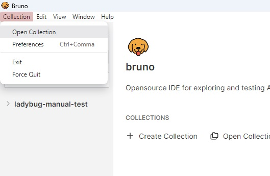
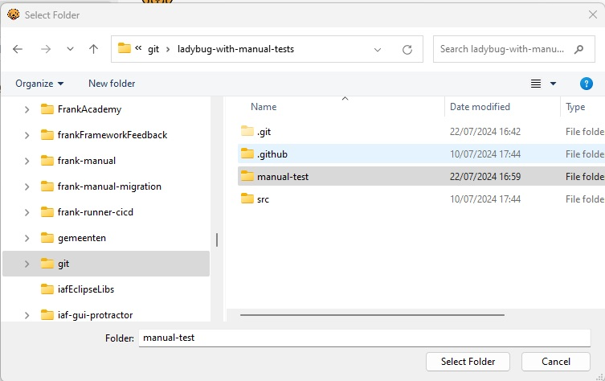
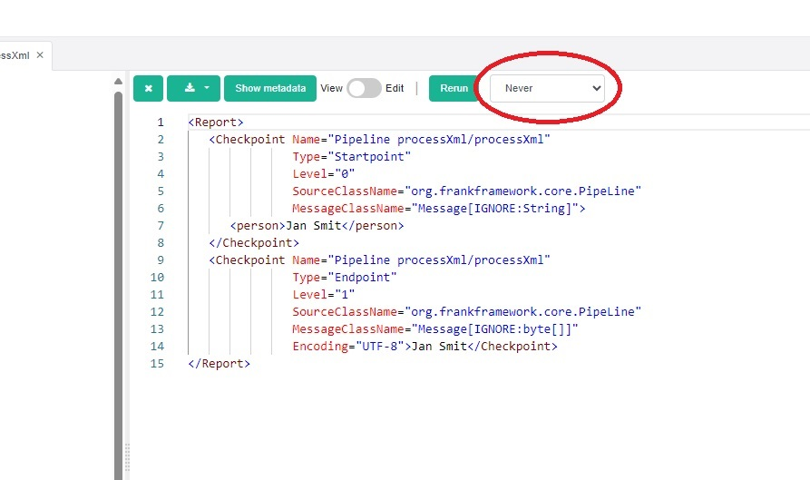

Manual Test
===========

Ladybug is tested by [automated tests](./README.md#cicd). These automated tests do not cover all features of Ladybug. This document presents tests to be done manually. Please perform these tests before making a release of ladybug or a release of [ladybug-frontend](https://github.com/wearefrank/ladybug-frontend).

# Contents

- [Preparations](#preparations)
  - [Bruno](#bruno)
  - [Checkout](#checkout)
  - [Configure Frank!Runner to run backend - latest code](#configure-frankrunner-to-run-backend-latest-code)
  - [Start up - latest code](#start-up-latest-code)
  - [Configure Frank!Runner to run backend - Nexus release](#configure-frankrunner-to-run-backend-nexus-release)
  - [Start up - Nexus release](#start-up-nexus-release)
- [Tests](#tests)
  - [Test 5: Version numbers](#test-5-version-numbers)
  - [Test 10: Debug tab tree view, layout of checkpoints](#test-10-debug-tab-tree-view-layout-of-checkpoints)
  - [Test 20: Views in the debug tree](#test-20-views-in-the-debug-tree)
  - [Test 30: Authorization](#test-30-authorization)
  - [Test 40: Stubbing](#test-40-stubbing)
  - [Test 50: Toast messages](#test-50-toast-messages)
  - [Test 60: Rerun and compare](#test-60-rerun-and-compare)
  - [Test 70: Low-level error should be shown](#test-70-low-level-error-should-be-shown)

# Preparations

The options you have to run ladybug are described in [the readme](./README.md#how-to-change-and-test-ladybug). Here we present more detailed instructions. You some different options about what code you want to test:

* You can test the Nexus release of the Frank!Framework and the ladybug that is included in that release.
* You can test the latest code of the Frank!Framework, ladybug and ladybug-frontend.
* You can test the latest code of the Frank!Framework and ladybug, but use the Nexus release of ladybug-frontend that is referenced in the `pom.xml` of the ladybug backend.

The instructions below make clear what to do for each of these choices.

> [!WARNING]
> The instructions below were mostly executed using a MinGW command
> prompt that emulates Linux. If you use a DOS prompt or PowerShell, please
> use equivalent commands that are valid in your shell instead of literally
> using the shown commands. The exeption is calling `restart.bat`, which you
> probably cannot do in a MinGW command prompt. For readability, all paths
> are shown with `/` as the path separator, even though a DOS prompt uses
> `\`.

Please do the following:

### Bruno

Please install HTTP client Bruno. You need it to issue HTTP requests to Frank
configs. The requests to issue have been prepared along with this test
description. Get it from https://www.usebruno.com/.

### Checkout

* Create a work directory for performing these tests, say `work`.
* Open a command prompt and change directory to `work`.
* Clone the Frank!Runner, the Frank!Framework, ladybug and ladybug-frontend with the following commands:

  * `git clone https://github.com/wearefrank/frank-runner`.
  * `git clone https://github.com/frankframework/frankframework` (not needed to test Nexus release of FF!).
  * `git clone https://github.com/wearefrank/ladybug` (not needed to test Nexus release of FF!).
  * `git clone https://github.com/wearefrank/ladybug-frontend` (only needed if latest code of ladybug-frontend is tested).
* You should have a different clone of https://github.com/wearefrank/ladybug to read this test description from and to reference test configurations from. We refer to it as `ladybug-test`.
* In directory `work`, check out the versions you want for the F!F and ladybug. You can not choose arbitrarily what vesions to combine. The ladybug backend version used by the FF! is in `work/frankframework/ladybug/pom.xml`, the line `<ladybug.version>...</ladybug.version>` under `<properties>`. That value should be the artifact version mentioned in `work/ladybug/pom.xml`. You can omit this step for now if you want to test the latest ladybug-frontend code.
* If you test the latest code of ladybug-frontend, do the following:
  * Check out the version of ladybug-frontend you want.
  * File `work/ladybug/pom.xml` should be updated to reference the SNAPSHOT version that is in `work/ladybug-frontend/pom.xml`. You can do all updates of `pom.xml` files by running a single ANT script. See `work/frank-runner/specials/util/syncPomVersions/`. If you run this script, no additional manual manipulations of `pom.xml` files are needed.
  * Manually run the Maven build of `work/ladybug-frontend`.

### Configure Frank!Runner to run backend (latest code)

* Change directory to `work/frank-runner/specials/ladybug`.Copy `build-example.properties` to `build.properties`.
* Uncomment line `test.with.iaf=true` in the `build.properties` you created in the previous step. Uncomment some other lines if you want to speed up the build.
* Change directory to `work/frank-runner/specials/iaf-webapp`.
* Copy `build-example.properties` to `build.properties`.
* Search for the line `# configurations.dir=...`. Replace it by `configurations.dir=<path-to-ladybug-checkout-with-this-test-description>/manual-test/configurations`.
* Uncomment some lines of `build.properties` to speed up the build of the FF!.

### Start up (latest code)

* Change directory to `work/frank-runner/specials/ladybug`. Run the command `./restart.bat`.

### Configure Frank!Runner to run backend (Nexus release)

In this case, the `build.properties` files you have in subdirectories of `work/frank-runner/specials` are not used. Create `work/frank-runner/build.properties` with the following contents:

    # Use this one to allow relative path for project.dir
    # Path given is itself relative to work/frank-runner
    projects.dir=..

    project.dir=<ladybug-test>/manual-test

### Start up (Nexus release)

* Change directory to `work/frank-runner`. Run command `./restart.bat`.

# Tests

### Test 5: Version numbers

**Step 10:** Open ladybug. Check whether the version numbers of the ladybug backend and the ladybug frontend are shown somewhere.

### Test 10: Debug tab tree view, layout of checkpoints

**Step 10:** In the Frank!Framework, use "Test a Pipeline" to run adapter "processXml" with input message `<person>Jan Smit</person>
`.

**Step 20:** In the Frank!Framework, use "Test a Pipeline" to run adapter "processXml" with input message `<person2>Jan Smit</person2>
`.

**Step 30:** In Ladybug, go to the Debug tab. Press the refresh button to refresh the table of reports. Check that the following are true:

* The last two reports have in their "Name" column the value `Pipeline processXml`.
* The second-last report is green to indicate success.
* The last report is red to indicate failure.

**Step 40:** Open the second-last report (the successful one). It should appear in the tree view below the table.

**Step 43:** Check that not the root node of the report but the child node right below that is selected by default.

**Step 46:** Check that at least the following nodes exist with the shown indentation:

* Directory icon `Pipeline processXml`.
  * Right arrow `Pipeline processXml` (selected by default, **step 43**).
    * Right arrow `Pipe validate`.
      * Information `Pipe validate`.
      * Left arrow `Pipe validate`.
    * Right arrow `Pipe getPersonNamePipe`.
      * Information `Pipe getPersonNamePipe`.
      * Right arrow `Sender getPersonNameSender`.
        * Right arrow `Pipeline getPersonName`.
          * Pipe `Pipe applyXslt`.
            * Information `Pipe applyXslt`.
            * Information `./getName.xsl`.
            * Left arrow `Pipe applyXslt`.
          * Pipe `Pipe checkForError`.
            * Information `Pipe checkForError`.
            * Left arrow `Pipe checkForError`.
          * Left arrow `exit state`.
          * Left arrow `Pipeline getPersonName`.
        * Left arrow `getPersonNameSender`.
      * Left arrow `getPersonNamePipe`.
    * Left arrow `Pipeline processXml`.

**Step 50:** Are there nodes in addition to the ones shown in **Step 40**? Are these to be expected?

**Step 60:** Collapse and expand the nodes. Does this look good?

**Step 70:** Click each node and check its value as shown in the pane to the right of the tree. Does each node have a meaningful value?

**Step 100:** In the report table, open the last report (the unsuccessful one). It should appear in the tree view below the table. Check that at least the following nodes exist with the shown indentation:

* Directory icon `Pipeline processXml`.
  * Right arrow `Pipeline processXml`.
    * Right arrow `Pipe validate`.
      * Information `Pipe validate`.
      * Red cross `Pipe validate`.
    * Red cross `Pipeline processXml`.

**Step 110:** Are there nodes in addition to the ones shown in **Step 40**? Are these to be expected?

**Step 120:** Collapse and expand the nodes. Does this look good?

**Step 130:** Click each node and check its value as shown in the pane to the right of the tree. Does each node have a meaningful value?

### Test 20: Views in the debug tree

**Step 10:** Open Bruno and import the prepared requests as shown. The directory to select is in the checkout of this test description.

The result should be as shown:

**Step 20:** Apply the request named "Conclusion - valid".

**Step 30:** Go to ladybug and press refresh.

**Step 40:** Open the most recent report from the table (top row) in the debug tree by clicking.

**Step 50:** Check that there is:

* a root node with "Pipeline" in the name;
* another "Pipeline" start node for the pipeline;
* a start node for every pipe;
* input and output points for the session keys;
* a start point for node "Sender sendToMundo" within "Pipe sendToMundo".

**Step 60:** In Ladybug select view "Black box".

**Step 70:** Check that only the following nodes are left:

TODO: Add screen capture, to be made when the black box view works.

TODO: Then continue writing this test.

**Step 200:** Stop the FF!. Under Windows you can do this by pressing Ctrl-C in the Tomcat window.

**Step 210:** Restart the FF! with another springIbisTestTool that is dedicated to testing views. In a command prompt in directory `work/frank-runner/specials/ladybug`, run `./restart.bat -Dcustom=TestLadybugReportTableDifferentViewsDifferentColumns`. This adds a view named `White box view with less metadata`. This view has only the following metadata columns: "storageId", "name" and "correlationId".

**Step 220:** Switch between the views. Check that the columns in the report table change according to the selected view.

**Step 230:** Play with setting filters and adjusting the selected views. Are you able to manipulate reports into the table that do not agree with the shown filter? Do the different indicators of the applied filter remain in sync?

> [!NOTE]
> You can apply a filter on a column that exists in the white box view but not in the white box view with less metadata. When you apply such a filter and then switch to the view with less metadata, the filter is allowed to remain. This is OK when there is a clear indicator that the filter is still applied and if it is possible (for example with the clear button) to remove all filters.

### Test 30: Authorization

**Step 10:** This test starts with the situation of test 10.

**Step 20:** In the Frank!Runner checkpoint, add the following to `build/<Apache Tomcat dir>/conf/catalina.properties`:

    application.security.testtool.authentication.type=IN_MEMORY
    application.security.testtool.authentication.username=Admin
    application.security.testtool.authentication.password=Nimda

**Step 30:** Start the Frank!Framework.

**Step 40:** Browse to the Frank!Console. You should be allowed to view this without logging in.

**Step 50:** Browse to Ladybug. You should see a login dialog to enter the credentials. After providing these, you should have access to Ladybug.

**Step 60:** Rerun a report. Check that rerunning is allowed and that rerunning succeeds for a report that succeeded when created.

### Test 40: Stubbing

**Step 10:** Open Test a Pipeline. Run adapter `processXml` with input message `<person>Jan Smit</person>`. Check that this produces SUCCESS.

**Step 20:** Go to Ladybug and find the report produced by the previous step. Open it in the debug tree.

**Step 30:** Create two copies in the Test tab. One with Stub Senders, the other with Never. Give the two copies meaningful descriptions to distinguish them. See picture below to locate that control:

**Step 40:** Stop the Frank!Framework. Update file `<ladybug-test>/manual-test/configurations/processXml/getName.xsl` so that an extra string is added to the output. Edit line `<xsl:value-of select="." />`. The aim is to change the result of the `processXml` adapter.

**Step 50:** Restart the FF! and rerun the two reports. The one with stubbed senders should succeed. The one without stubbing should fail.

**Step 60:** Stop the FF! and undo the change to `<ladybug-test>/manual-test/configurations/processXml/getName.xsl`.

### Test 50: Toast messages

**Step 10:** Go to the debug tab and select a report. Press the delete button.

**Step 20:** There should appear a toast message to the bottom right saying "data loaded!". Click that toast message before it disappears.

**Step 30:** A larger window should appear with the toast message in it and possibly more detailed information.

### Test 60: Rerun and compare

**Step 10:** Run Adapter1a. Copy the resulting report to the test tab. Press edit. Change the message of the last checkpoint. Save.

**Step 20:** In the test tab, rerun the edited report. It should produce a negative result (red message to the right).

**Step 30:** Press compare.

**Step 40:** There should be two tree views, one to the left and one to the right. At both sides, all nodes except the last should be black. The last node at both sides should be red.

**Step 50:** Check that the node comparison algorithm is "Path".

**Step 60:** Select nodes on the left and on the right. Each time a node is selected on one side, the corresponding node should be selected on the other side.

**Step 70:** For each selection of nodes, check that the corresponding values are shown to the bottom. Check that if the values on both sides are different, the differences are highlighted.

**Step 80:** Change the node comparison algorithm to "None". Select nodes to the left and to the right. Check that selecting a node on one side does not affect the other side.

### Test 70: Low-level error should be shown

This test should be executed with the ladybug test webapp. The maintainers of Ladybug know how to start this, so documenting the required preparations is postponed.

**Step 10:** Start the ladybug test webapp and create a report.

**Step 20:** Stop ladybug.

**Step 30:** Locate the directory that holds the stored ladybug reports (should be a subdir of `data`). Rename it.

**Step 30:** Restart ladybug. Check that an error message is shown.
